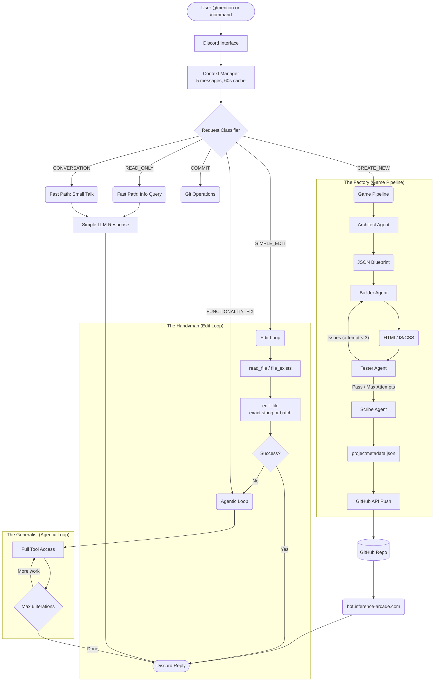

# Bot Sportello: System Architecture & Operation Flow

This document provides a comprehensive visualization of **Bot Sportello's** internal logic, mapping the journey from a user's Discord message to a deployed application.

---

## 1. High-Level Architecture

The system operates as a **multi-pipeline agent** driven by a central classifier. It distinguishes between *creative* tasks (building content), *maintenance* tasks (edits/fixes), and *administrative* tasks (commits/info).

### Core Components

| Component | Location | Purpose |
|-----------|----------|---------|
| **Discord Interface** | `index.js` | Handles slash commands, @mentions, message events |
| **Request Classifier** | `services/requestClassifier.js` | Categorizes user intent (keyword or LLM-based) |
| **Game Pipeline** | `services/gamePipeline.js` | Orchestrates Architect→Builder→Tester→Scribe |
| **LLM Client** | `services/llmClient.js` | Centralized API calls with role-specific prompts |
| **Git Helper** | `services/gitHelper.js` | GitHub API operations (Railway-compatible) |
| **Model Config** | `config/models.js` | Single source of truth for model presets |
| **HTML Templates** | `config/templates.js` | Scaffolds for games, stories, utilities |
| **Agent Modules** | `agents/*.js` | Architect, Builder, Tester, Scribe agents |

### Directory Structure

```
javabot/
├── index.js              # Main bot (~4900 lines)
├── config/
│   ├── models.js         # Model presets, reasoning config
│   └── templates.js      # HTML scaffolds by content type
├── services/
│   ├── requestClassifier.js
│   ├── gamePipeline.js
│   ├── llmClient.js
│   ├── gitHelper.js
│   ├── filesystem.js
│   ├── buildLogs.js
│   └── deepResearch.js
├── agents/
│   ├── gameArchitect.js
│   ├── gameBuilder.js
│   ├── gameTester.js
│   └── gameScribe.js
├── src/                  # Generated content
│   ├── *.html            # Pages and games
│   └── audio/            # Reusable audio components
└── docs/                 # Documentation
```

---

## 2. Master Logic Flow



---

## 3. Component Breakdown

### A. The Brain (Request Classifier)

Located in `services/requestClassifier.js`.

**Default Mode: Keyword-based** (no API call, instant classification)
- Set `CLASSIFIER_USE_LLM=true` in env to enable LLM classification

**Classification Buckets:**

| Type | Trigger | Route |
|------|---------|-------|
| `CREATE_NEW` | "create", "build", "generate", "new" | Game Pipeline |
| `SIMPLE_EDIT` | Simple text replacements | Edit Loop |
| `FUNCTIONALITY_FIX` | "fix", "bug", "css", "responsive" | Agentic Loop |
| `COMMIT` | "commit this", "push changes", "save" | Git Operations |
| `READ_ONLY` | "show", "list", "find", "what", "search" | Fast Path |
| `CONVERSATION` | Greetings, short messages (<20 chars) | Fast Path |

**Fast Paths** (NEW): `READ_ONLY` and `CONVERSATION` requests bypass tool calling entirely for speed. Simple LLM response with no function calls.

### B. The Factory (Game Pipeline)

Located in `services/gamePipeline.js` and `agents/`.

A 4-stage waterfall for generating content with quality control.

| Stage | Agent | Input | Output |
|-------|-------|-------|--------|
| **1. Plan** | Architect | User prompt + recent patterns | JSON Blueprint |
| **2. Build** | Builder | Blueprint + templates | Complete HTML |
| **3. Test** | Tester | Generated HTML | Pass/Fail + issues |
| **4. Doc** | Scribe | Final code | Metadata + logs |

**Content Types** (not just games):
- `arcade-game` - Scoring, mechanics, mobile controls required
- `story` / `letter` - Typography-focused, no controls
- `utility` - Forms, localStorage, tools
- `visualization` - Canvas, charts, data display
- `recipe` / `log` / `parody` - Narrative content

**Template System** (`config/templates.js`):
```javascript
// Scaffolds available:
GAME_SCAFFOLD     // Mobile controls, canvas, touch events
STORY_SCAFFOLD    // Typography, paragraphs, no controls
UTILITY_SCAFFOLD  // Forms, localStorage patterns
VIZ_SCAFFOLD      // Canvas, sliders, stats grid
```

### C. The Handyman (Edit Loops)

**Streamlined Edit Loop** (`getEditResponse`):
- **Goal**: Speed for simple changes
- **Tools**: `read_file`, `search_files`, `edit_file`, `file_exists`
- **Constraint**: Files can only be edited once per conversation

**General Agentic Loop** (`getLLMResponse`):
- **Goal**: Complex problem solving
- **Tools**: Full set including `web_search`, `create_page`, `build_game`
- **Limits**: Max 6 iterations, max 5 read-only iterations
- **Features**:
  - Action injection ("you just edited X, looking there first")
  - Model fallback on 500 errors

### D. The Tool Belt

| Tool | Parameters | Purpose |
|------|------------|---------|
| `list_files` | `path` | Directory listing grouped by extension |
| `read_file` | `path` | Read file (5000 char limit) |
| `search_files` | `pattern` | Regex grep across codebase |
| `file_exists` | `path\|url` | Fast check with fuzzy matching |
| `edit_file` | `path, old, new` OR `replacements[]` | Exact string replacement or batch |
| `write_file` | `path, content` | Create/overwrite file |
| `create_page` | `name, description` | Equivalent to `/add-page` |
| `create_feature` | `name, description` | Equivalent to `/add-feature` |
| `build_game` | `title, prompt, type` | Equivalent to `/build-game` |
| `commit_changes` | `message, files` | Git add, commit, push |
| `get_repo_status` | - | Repository status |
| `set_model` | `model` | Switch AI model at runtime |
| `web_search` | `query` | Internet search via Perplexity Sonar |

---

## 4. Model Configuration

**Single Source of Truth**: `config/models.js`

### Available Models (ZDR-Compliant Only)

| Key | Model | Notes |
|-----|-------|-------|
| `glm` | GLM-4.7 | Default, reliable |
| `kimi` | Kimi K2 Thinking | Reasoning support |
| `kimi-fast` | Kimi K2 (exacto) | Fast, no reasoning |
| `deepseek` | DeepSeek V3.1 Terminus | Fallback option |
| `qwen` | Qwen 3 Coder | Code-focused |
| `mimo` | MiMo V2 Flash | Xiaomi, fast |
| `minimax` | Minimax M2.1 | Alternative |

**Why ZDR-Only**: All requests use `provider: { data_collection: 'deny' }`. OpenAI models excluded because they don't support ZDR on OpenRouter.

### Model Utilities

```javascript
const {
    MODEL_PRESETS,
    getDefaultModel,      // Returns 'z-ai/glm-4.7'
    isValidModelKey,      // Validates model key
    getModelChoices,      // For slash command options
    getReasoningConfig    // Returns reasoning params or null
} = require('./config/models');
```

---

## 5. GitHub Integration (Railway-Compatible)

**No local git required** - All operations use GitHub API via Octokit.

### gitHelper.js Functions

| Function | Purpose |
|----------|---------|
| `pushFileViaAPI(path, content, message)` | Create/update single file |
| `pushMultipleFiles(files[], message)` | Batch commit multiple files |
| `getExistingFileSha(path)` | Get SHA for update operations |
| `getRepoStatus()` | Repository info via API |

### Commit Flow


---

## 6. Reusable Components

### Audio Components (`src/audio/`)

**SportelloAmbient** - Ambient sound mixer:
```html
<script src="audio/sportello-ambient.js"></script>
<script>
SportelloAmbient.init({
    sounds: ['rain', 'ocean', 'wind', 'whitenoise'],
    theme: 'noir'  // or 'sleep'
});
</script>
```

**SportelloNarrator** - Text-to-speech for stories:
```html
<script src="audio/sportello-narrator.js"></script>
<script>
SportelloNarrator.init({
    voice: 'Ralph',  // Bot Sportello's voice
    selector: '.paragraph'
});
</script>
```

---

## 7. Safety & Resilience

### Error Handling

| Mechanism | Implementation |
|-----------|----------------|
| **Error Loop Prevention** | 3 errors per user/command = 5min cooldown |
| **Message Deduplication** | Track processed message IDs |
| **Git Timeout** | 5s timeout on status checks |
| **Model Fallback** | Auto-switch after 2x 500 errors |
| **402 Recovery** | Reduce max_tokens on credit errors |

### Retry Logic

- **axios-retry**: 3 retries with exponential backoff for network errors
- **Pipeline retries**: Up to 3 build attempts if Tester finds issues
- **Conversation context**: 60-second cache prevents rate limiting

### Scope Guards

- **Files edited once**: Prevents expensive repeated edits
- **Read-only iterations**: Max 5 to prevent infinite loops
- **Response length**: >2000 chars saved to `responses/` directory

---

## 8. Data Persistence

| Storage | Purpose | Lifecycle |
|---------|---------|-----------|
| `projectmetadata.json` | Page registry | Persistent, updated per creation |
| `build-logs/{id}.json` | Pipeline execution logs | One per build |
| `responses/{ts}.txt` | Long responses | One per oversized response |
| `session-logs/*.json` | Bot session reports | One per run via run-bot.sh |
| Discord API | Conversation context | 5 messages, 60s cache |

---

## 9. Slash Commands

| Command | Handler | Route |
|---------|---------|-------|
| `/add-page` | `handleAddPage` | Creates single HTML page |
| `/add-feature` | `handleAddFeature` | Creates JS + demo HTML |
| `/build-game` | `handleBuildGame` | Full pipeline (Architect→Scribe) |
| `/commit` | `handleCommit` | Git add, commit, push |
| `/status` | `handleStatus` | Repo status + live URL |
| `/chat` | `handleChat` | AI conversation |
| `/search` | `handleSearch` | Web search |
| `/set-model` | `handleSetModel` | Switch AI model |
| `/set-prompt` | `handleSetPrompt` | Modify system prompt |
| `/poll` | `handlePoll` | Yes/no poll (no defer) |

---

## 10. Adding New Functionality

### New Slash Command

1. Add `SlashCommandBuilder` to `commands` array in index.js
2. Add case to switch in `interactionCreate` handler
3. Create `async function handle{Name}(interaction)`
4. Commands auto-register on bot restart

### New AI Tool

1. Add tool definition to `tools` array in `getLLMResponse()`
2. Add handler in tool execution switch statement
3. Create helper function
4. Update `SYSTEM_PROMPT` capabilities section

### New Content Type

1. Add scaffold to `config/templates.js`
2. Update Architect prompt in `services/llmClient.js`
3. Add collection to `projectmetadata.json`
4. Update Tester validation rules if needed

---

## 11. Environment Variables

```bash
# Required
DISCORD_TOKEN           # Bot token
DISCORD_CLIENT_ID       # Application ID
GITHUB_TOKEN            # PAT with repo permissions
GITHUB_REPO_OWNER       # "milwrite"
GITHUB_REPO_NAME        # "javabot"
GITHUB_REPO_URL         # Full URL
CHANNEL_ID              # Comma-separated channel IDs
OPENROUTER_API_KEY      # API key

# Optional
CLASSIFIER_USE_LLM      # "true" to enable LLM classification
CLASSIFIER_MODEL        # Model for classifier (default: glm)
CLASSIFIER_TIMEOUT_MS   # Timeout in ms (default: 3500)
NO_GUI                  # "true" to disable dashboard
```

---

## Appendix: Quick Reference

### Noir Theme Palette
```css
--accent: #7ec8e3;     /* Light blue text */
--buttons: #ff0000;    /* Red interactive */
--headers: #00ffff;    /* Cyan emphasis */
--background: #0a0a0a; /* True black */
--font: 'Courier Prime', monospace;
```

### Mobile Breakpoints
- `768px` - Tablet
- `480px` - Mobile
- Touch targets: minimum `44px`

### Key Timeouts
- Git operations: `30s`
- Git push: `60s`
- API requests: `60s`
- Classifier: `3.5s`
- Context cache: `60s`
